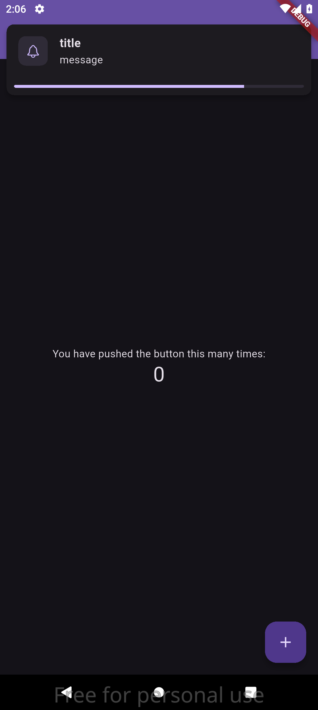
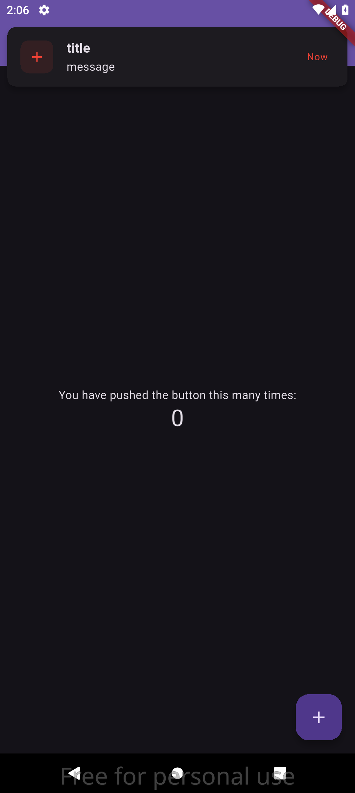
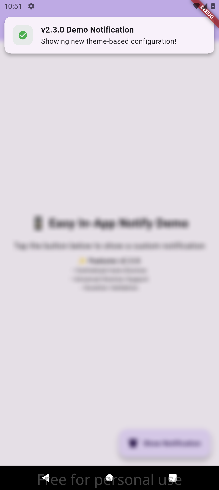

# 🔔 Easy In-App Notify

[](https://pub.dev/packages/easy_in_app_notify)
[](https://opensource.org/licenses/MIT)
[](https://flutter.dev)

**Beautiful, modern, and highly customizable in-app notifications for Flutter applications.**

Transform your app's user experience with stunning notifications that slide, fade, and scale with smooth animations. Perfect for status updates, alerts, confirmations, and user feedback.

## 📋 Table of Contents

- [📱 Screenshots](#-screenshots)
- [✨ Features](#-features)
- [🚀 Quick Start](#-quick-start)
  - [Installation](#installation)
  - [Basic Setup](#basic-setup)
  - [Integration with Other Packages](#integration-with-other-packages)
  - [Show Your First Notification](#show-your-first-notification)
- [🎨 Feature Showcase](#-feature-showcase)
  - [Different Notification Types](#different-notification-types)
  - [Positions & Animations](#positions--animations)
  - [Interactive Features](#interactive-features)
- [📖 Complete Usage Guide](#-complete-usage-guide)
  - [Basic Notifications](#basic-notifications)
  - [Advanced Custom Notifications](#advanced-custom-notifications)
  - [Positioning Options](#positioning-options)
  - [Animation Types](#animation-types)
  - [Progress Bars & Auto-Dismiss](#progress-bars--auto-dismiss)
  - [Interactive Notifications](#interactive-notifications)
  - [Persistent Notifications](#persistent-notifications)
  - [Background Blur Effects](#background-blur-effects)
  - [Multiple Notifications](#multiple-notifications)
- [🎛️ API Reference](#️-api-reference)
  - [NotificationContent](#notificationcontent)
  - [NotificationStyle](#notificationstyle)
  - [NotificationConfig](#notificationconfig)
  - [Enums](#enums)
  - [Static Methods](#static-methods)
- [🎨 Styling Examples](#-styling-examples)
  - [Material Design 3 Theme](#material-design-3-theme)
  - [Dark Theme Support](#dark-theme-support)
  - [Custom Brand Colors](#custom-brand-colors)
- [🔧 Migration Guide](#-migration-guide)
  - [From v2.x to v3.0](#from-v2x-to-v30)
- [🔍 Examples & Demos](#-examples--demos)
- [❓ Frequently Asked Questions](#-frequently-asked-questions)
- [🤝 Contributing](#-contributing)
- [📄 License](#-license)
- [🙏 Acknowledgments](#-acknowledgments)

## 📱 Screenshots

<table>
<tr>
<td align="center">

<br><b>Success Notification</b>
</td>
<td align="center">

<br><b>Error Notification</b>
</td>
<td align="center">

<br><b>Custom Styling</b>
</td>
</tr>
</table>

> 📱 **Live Demo:** The images above show the actual notification styles. Run `flutter run` in the [example](example/) folder to see all 16 notification types in action!

> ⚠️ **Note:** If images don't display in GitHub, they will be visible once the package is published to pub.dev.

## ✨ Features

### 🎨 **Beautiful Design**

- Material Design 3 compatible
- Pre-built themes for Success, Error, Warning, and Info
- Fully customizable colors, typography, and spacing
- Smooth rounded corners and elegant shadows

### 🎭 **Rich Animations**

- **Slide** animations from top, bottom, or sides
- **Fade** animations with opacity transitions
- **Scale** animations that grow from center
- **Custom** animation durations and curves
- Background blur effects with animated opacity

### 📍 **Flexible Positioning**

- **Top** positioning for status updates
- **Bottom** positioning for action confirmations
- **Center** positioning for important alerts
- Responsive margins and safe area handling

### ⚡ **Smart Features**

- **Auto-dismiss** with configurable duration
- **Progress bars** showing countdown visualization
- **Tap-to-dismiss** and **swipe-to-dismiss** interactions
- **Hover effects** that pause auto-dismiss timers
- **Multiple notifications** or single notification modes

### 🛠️ **Developer Friendly**

- Simple, intuitive API with method chaining
- Comprehensive TypeScript-style documentation
- Zero breaking changes from previous versions
- Built-in accessibility support
- Memory efficient with automatic cleanup

## 🚀 Quick Start

### Installation

Add to your `pubspec.yaml`:

```yaml
dependencies:
  easy_in_app_notify: ^3.0.0
```

Run the installation:

```bash
flutter pub get
```

### Basic Setup

Initialize the notification system in your `MaterialApp`:

```dart
import 'package:easy_in_app_notify/easy_in_app_notify.dart';

class MyApp extends StatelessWidget {
  @override
  Widget build(BuildContext context) {
    return MaterialApp(
      title: 'My App',
      builder: EasyInAppNotify.init(), // 👈 Add this line
      home: MyHomePage(),
    );
  }
}
```

### Show Your First Notification

```dart
EasyInAppNotify.showSuccess(
  title: 'Welcome!',
  message: 'Your account has been created successfully.',
);
```

That's it! 🎉

### Integration with Other Packages

If you're using other packages that also require a `builder` in `MaterialApp` (like `flutter_easyloading`, `bot_toast`, etc.), you can chain the builders together:

#### With EasyLoading

```dart
import 'package:easy_in_app_notify/easy_in_app_notify.dart';
import 'package:flutter_easyloading/flutter_easyloading.dart';

class MyApp extends StatelessWidget {
  @override
  Widget build(BuildContext context) {
    return MaterialApp(
      title: 'My App',
      builder: (context, child) {
        // Chain multiple builders
        child = EasyLoading.init()(context, child);
        child = EasyInAppNotify.init()(context, child);
        return child;
      },
      home: MyHomePage(),
    );
  }
}
```

#### Alternative Nested Approach

```dart
class MyApp extends StatelessWidget {
  @override
  Widget build(BuildContext context) {
    return MaterialApp(
      title: 'My App',
      builder: EasyLoading.init(
        builder: (context, child) {
          return EasyInAppNotify.init()(context, child);
        },
      ),
      home: MyHomePage(),
    );
  }
}
```

#### With Multiple Packages

```dart
class MyApp extends StatelessWidget {
  @override
  Widget build(BuildContext context) {
    return MaterialApp(
      title: 'My App',
      builder: (context, child) {
        // Add as many builders as needed
        child = EasyLoading.init()(context, child);
        child = BotToastInit()(context, child);
        child = EasyInAppNotify.init()(context, child);
        return child;
      },
      home: MyHomePage(),
    );
  }
}
```

> **💡 Tip**: The order matters! Place `EasyInAppNotify.init()` last to ensure notifications appear on top of other overlays.

## 🎨 Feature Showcase

### Different Notification Types

```dart
// Success (Green theme with checkmark)
EasyInAppNotify.showSuccess(title: 'Success!', message: 'Task completed');

// Error (Red theme with error icon)
EasyInAppNotify.showError(title: 'Error', message: 'Something went wrong');

// Warning (Orange theme with warning icon)
EasyInAppNotify.showWarning(title: 'Warning', message: 'Please check input');

// Info (Blue theme with info icon)
EasyInAppNotify.showInfo(title: 'Info', message: 'New update available');
```

### Positions & Animations

```dart
// Top slide animation (default)
EasyInAppNotify.show(
  content: NotificationContent(title: 'Top Notification'),
  style: NotificationStyle(position: NotificationPosition.top),
);

// Center with scale animation
EasyInAppNotify.show(
  content: NotificationContent(title: 'Center Alert'),
  style: NotificationStyle(
    position: NotificationPosition.center,
    animation: NotificationAnimation.scale,
  ),
);

// Bottom with fade animation
EasyInAppNotify.show(
  content: NotificationContent(title: 'Bottom Notice'),
  style: NotificationStyle(
    position: NotificationPosition.bottom,
    animation: NotificationAnimation.fade,
  ),
);
```

### Interactive Features

```dart
// Progress bar with countdown
EasyInAppNotify.show(
  content: NotificationContent(title: 'Downloading...', icon: Icons.download),
  style: NotificationStyle(showProgressBar: true),
  config: NotificationConfig(duration: 8),
);

// Background blur effect
    EasyInAppNotify.show(
  content: NotificationContent(title: 'Premium Feature'),
  style: NotificationStyle(
    enableBackgroundBlur: true,
    position: NotificationPosition.center,
  ),
);

// Tap to interact
    EasyInAppNotify.show(
  content: NotificationContent(title: 'Tap me!'),
  config: NotificationConfig(
    dismissOnTap: true,
    onTap: () => print('Notification tapped!'),
  ),
);
```

## 📖 Complete Usage Guide

### Basic Notifications

Use the convenience methods for common notification types:

```dart
// Success notification (green theme)
EasyInAppNotify.showSuccess(
  title: 'Success!',
  message: 'Your data has been saved.',
);

// Error notification (red theme)
EasyInAppNotify.showError(
  title: 'Error',
  message: 'Failed to connect to server.',
);

// Warning notification (orange theme)
EasyInAppNotify.showWarning(
  title: 'Warning',
  message: 'Please check your input.',
);

// Info notification (blue theme)
EasyInAppNotify.showInfo(
  title: 'Info',
  message: 'New update available.',
);
```

### Advanced Custom Notifications

For complete control, use the main `show()` method:

```dart
      EasyInAppNotify.show(
  content: NotificationContent(
    title: 'Custom Notification',
    message: 'This notification is fully customized.',
    icon: Icons.star,
    trailing: Icon(Icons.arrow_forward),
  ),
  style: NotificationStyle(
    primaryColor: Colors.purple,
    backgroundColor: Colors.purple.shade50,
    textColor: Colors.purple.shade900,
    borderRadius: 16,
    elevation: 8,
    position: NotificationPosition.center,
    animation: NotificationAnimation.scale,
    showProgressBar: true,
    enableBackgroundBlur: true,
  ),
  config: NotificationConfig(
    duration: 5,
    dismissOnTap: true,
    onTap: () => print('Notification tapped!'),
    onDismissed: () => print('Notification dismissed!'),
  ),
);
```

### Positioning Options

Control where your notifications appear:

```dart
// Top of screen (default)
      EasyInAppNotify.show(
  content: NotificationContent(title: 'Top Notification'),
  style: NotificationStyle(position: NotificationPosition.top),
);

// Bottom of screen
      EasyInAppNotify.show(
  content: NotificationContent(title: 'Bottom Notification'),
  style: NotificationStyle(position: NotificationPosition.bottom),
);

// Center of screen
EasyInAppNotify.show(
  content: NotificationContent(title: 'Center Notification'),
  style: NotificationStyle(position: NotificationPosition.center),
);
```

### Animation Types

Choose from different animation styles:

```dart
// Slide animation (default)
    EasyInAppNotify.show(
  content: NotificationContent(title: 'Slide Animation'),
  style: NotificationStyle(
    animation: NotificationAnimation.slide,
    animationDuration: Duration(milliseconds: 400),
  ),
);

// Fade animation
    EasyInAppNotify.show(
  content: NotificationContent(title: 'Fade Animation'),
  style: NotificationStyle(
    animation: NotificationAnimation.fade,
    position: NotificationPosition.center,
  ),
);

// Scale animation
      EasyInAppNotify.show(
  content: NotificationContent(title: 'Scale Animation'),
  style: NotificationStyle(
    animation: NotificationAnimation.scale,
    position: NotificationPosition.center,
  ),
);
```

### Progress Bars & Auto-Dismiss

Show progress indicators and control timing:

```dart
      EasyInAppNotify.show(
  content: NotificationContent(
    title: 'Downloading...',
    message: 'Please wait while we download your files.',
    icon: Icons.download,
  ),
  style: NotificationStyle(
    primaryColor: Colors.blue,
    showProgressBar: true, // 👈 Enable progress bar
  ),
  config: NotificationConfig(
    duration: 8, // 👈 8 seconds auto-dismiss
  ),
);
```

### Interactive Notifications

Add tap handlers and custom behaviors:

```dart
EasyInAppNotify.show(
  content: NotificationContent(
    title: 'New Message',
    message: 'Tap to read your message.',
    icon: Icons.message,
  ),
  config: NotificationConfig(
    dismissOnTap: true, // 👈 Dismiss when tapped
    onTap: () {
      // Handle tap
      Navigator.pushNamed(context, '/messages');
    },
    onDismissed: () {
      // Handle dismissal
      print('User dismissed notification');
    },
  ),
);
```

### Persistent Notifications

Create notifications that stay until manually dismissed:

```dart
EasyInAppNotify.show(
  content: NotificationContent(
    title: 'Important Update',
    message: 'Please update your password.',
    icon: Icons.security,
  ),
  config: NotificationConfig.persistent(), // 👈 No auto-dismiss
);
```

### Background Blur Effects

Add beautiful blur effects behind notifications:

```dart
      EasyInAppNotify.show(
  content: NotificationContent(
    title: 'Premium Feature',
    message: 'Unlock advanced features with Pro.',
  ),
  style: NotificationStyle(
    enableBackgroundBlur: true, // 👈 Enable blur
    backgroundBlurOpacity: 0.3, // 👈 Control blur intensity
    position: NotificationPosition.center,
  ),
);
```

### Multiple Notifications

Show multiple notifications simultaneously:

```dart
// Allow multiple notifications
EasyInAppNotify.show(
  content: NotificationContent(title: 'First notification'),
  config: NotificationConfig(allowMultiple: true),
);

EasyInAppNotify.show(
  content: NotificationContent(title: 'Second notification'),
  style: NotificationStyle(position: NotificationPosition.bottom),
  config: NotificationConfig(allowMultiple: true),
);
```

## 🎛️ API Reference

### NotificationContent

Defines what content to show in the notification:

```dart
NotificationContent(
title: 'Required title text',
message: 'Optional message text',
icon: Icons.check_circle, // Optional icon
trailing: Widget(), // Optional trailing widget
customContent: Widget(), // Replace entire content area
)
```

**Convenience Constructors:**

- `NotificationContent.success()` - Pre-configured for success
- `NotificationContent.error()` - Pre-configured for errors
- `NotificationContent.warning()` - Pre-configured for warnings
- `NotificationContent.info()` - Pre-configured for information

### NotificationStyle

Controls the visual appearance and animations:

```dart
NotificationStyle(
// Colors
primaryColor: Colors.blue,
backgroundColor: Colors.white,
textColor: Colors.black87,
iconColor: Colors.blue,

// Layout
borderRadius: 8.0,
elevation: 4.0,
margin: EdgeInsets.all(16),
padding: EdgeInsets.all(16),
maxWidth: 400.0,

// Position & Animation
position: NotificationPosition.top,
animation: NotificationAnimation.slide,
animationDuration: Duration(milliseconds: 300),

// Features
showProgressBar: false,
enableSwipeToDismiss: true,
enableBackgroundBlur: false,
backgroundBlurOpacity: 0.1,
)
```

**Convenience Constructors:**

- `NotificationStyle.success()` - Green theme
- `NotificationStyle.error()` - Red theme
- `NotificationStyle.warning()` - Orange theme
- `NotificationStyle.info()` - Blue theme

### NotificationConfig

Controls behavior and interaction:

```dart
NotificationConfig(
  duration: 4, // Auto-dismiss after 4 seconds
  dismissOnTap: false, // Dismiss when notification is tapped
  pauseOnHover: true, // Pause timer when mouse hovers
  allowMultiple: false, // Allow multiple notifications

  // Callbacks
  onTap: () {}, // Called when notification is tapped
  onDismissed: () {}, // Called when notification is dismissed
  onShow: () {}, // Called when notification starts showing
)
```

**Convenience Constructors:**

- `NotificationConfig.persistent()` - Never auto-dismiss
- `NotificationConfig.quick()` - 2 seconds duration
- `NotificationConfig.long()` - 8 seconds duration

### Enums

```dart
enum NotificationPosition { top, bottom, center }
enum NotificationAnimation { slide, fade, scale, none }
```

### Static Methods

```dart
// Convenience methods
EasyInAppNotify.showSuccess(title: 'Title', message: 'Message');
EasyInAppNotify.showError(title: 'Title', message: 'Message');
EasyInAppNotify.showWarning(title: 'Title', message: 'Message');
EasyInAppNotify.showInfo(title: 'Title', message: 'Message');

// Main method
String id = EasyInAppNotify.show(content: content, style: style, config: config);

// Control methods
EasyInAppNotify.dismiss(id); // Dismiss specific notification
EasyInAppNotify.dismissAll(); // Dismiss all notifications

// State queries
bool showing = EasyInAppNotify.hasActiveNotifications;
int count = EasyInAppNotify.activeCount;

// Initialization
TransitionBuilder builder = EasyInAppNotify.init();
```

## 🎨 Styling Examples

### Material Design 3 Theme

```dart
EasyInAppNotify.show(
  content: NotificationContent(
    title: 'Material Design',
    message: 'Following Material 3 guidelines.',
    icon: Icons.palette,
  ),
  style: NotificationStyle(
    primaryColor: Theme.of(context).colorScheme.primary,
    backgroundColor: Theme.of(context).colorScheme.surface,
    textColor: Theme.of(context).colorScheme.onSurface,
    borderRadius: 12,
    elevation: 3,
  ),
);
```

### Dark Theme Support

```dart
final isDark = Theme.of(context).brightness == Brightness.dark;

EasyInAppNotify.show(
  content: NotificationContent(title: 'Dark Theme Ready'),
  style: NotificationStyle(
    primaryColor: Colors.blue,
    backgroundColor: isDark ? Colors.grey[800] : Colors.white,
    textColor: isDark ? Colors.white : Colors.black87,
  ),
);
```

### Custom Brand Colors

```dart
EasyInAppNotify.show(
  content: NotificationContent(
    title: 'Brand Notification',
    message: 'Using your app\'s brand colors.',
  ),
  style: NotificationStyle(
    primaryColor: Color(0xFF6366F1), // Your brand color
    backgroundColor: Color(0xFFF0F9FF),
    textColor: Color(0xFF1E293B),
    borderRadius: 16,
    elevation: 8,
  ),
);
```

## 🔧 Migration Guide

### From v2.x to v3.0

Version 3.0 introduces a new, cleaner API while maintaining backward compatibility for basic usage.

#### ✅ What Still Works (No Changes Required)

```dart
// These still work exactly the same
EasyInAppNotify.showSuccess(title: 'Success');
EasyInAppNotify.showError(title: 'Error');
EasyInAppNotify.dismissAll();
```

#### 🔄 Recommended Updates

**Old v2.x Style:**

```dart
EasyInAppNotify.show(
  context,
  view: CustomWidget(),
  option: EasyInAppNotifyOption(duration: 3),
  theme: EasyInAppNotifyTheme(color: Colors.blue),
);
```

**New v3.0 Style:**

```dart
EasyInAppNotify.show(
  content: NotificationContent(
    title: 'Modern API',
    customContent: CustomWidget(),
  ),
  style: NotificationStyle(primaryColor: Colors.blue),
  config: NotificationConfig(duration: 3),
);
```

#### 📝 Class Name Changes

| v2.x                     | v3.0                  |
| ------------------------ | --------------------- |
| `EasyInAppNotifyOption`  | `NotificationConfig`  |
| `EasyInAppNotifyTheme`   | `NotificationStyle`   |
| `EasyInAppNotifyContent` | `NotificationContent` |

## 🔍 Examples & Demos

Check out the [example app](example/) for a comprehensive demonstration of all features:

```bash
cd example
flutter run
```

The example includes:

- ✅ 16 different notification types
- ✅ All animation types and positions
- ✅ Interactive features demonstration
- ✅ Styling and theming examples
- ✅ Performance testing with rapid notifications

## ❓ Frequently Asked Questions

### Q: Can I customize the notification layout completely?

**A:** Yes! Use the `customContent` parameter in `NotificationContent`:

```dart
EasyInAppNotify.show(
  content: NotificationContent(
    title: '', // Required but can be empty
    customContent: YourCustomWidget(),
  ),
);
```

### Q: How do I prevent notifications from overlapping?

**A:** By default, new notifications replace old ones. To allow multiple:

```dart
EasyInAppNotify.show(
  content: NotificationContent(title: 'Multiple'),
  config: NotificationConfig(allowMultiple: true),
);
```

### Q: Can I show notifications from anywhere in my app?

**A:** Yes! Once initialized with `EasyInAppNotify.init()`, you can show notifications from any widget, even outside the widget tree.

### Q: How do I handle notification taps for navigation?

**A:** Use the `onTap` callback in `NotificationConfig`:

```dart
EasyInAppNotify.show(
  content: NotificationContent(title: 'Navigate'),
  config: NotificationConfig(
    onTap: () => Navigator.pushNamed(context, '/route'),
  ),
);
```

### Q: Are notifications accessible for screen readers?

**A:** Yes! The package follows Flutter's accessibility guidelines and works with screen readers out of the box.

### Q: Can I control notification duration precisely?

**A:** Absolutely! Set any duration or disable auto-dismiss:

```dart
// Custom duration
NotificationConfig(duration: 10) // 10 seconds

// Never dismiss automatically
NotificationConfig.persistent()
```

## 🤝 Contributing

We welcome contributions! Please see our [Contributing Guide](CONTRIBUTING.md) for details.

### Development Setup

```bash
git clone https://github.com/mohamedmaher-dev/easy_in_app_notify.git
cd easy_in_app_notify
flutter pub get
cd example && flutter run
```

### Reporting Issues

Found a bug or have a feature request? Please open an issue on [GitHub](https://github.com/mohamedmaher-dev/easy_in_app_notify/issues).

## 📄 License

This project is licensed under the MIT License - see the [LICENSE](LICENSE) file for details.

## 🙏 Acknowledgments

- Built with ❤️ for the Flutter community
- Inspired by modern mobile notification patterns
- Thanks to all contributors and users who provided feedback

---

<p align="center">
  <a href="https://pub.dev/packages/easy_in_app_notify">
    
  </a>
  <a href="https://github.com/mohamedmaher-dev/easy_in_app_notify">
    
  </a>
</p>

<p align="center">
  Made with ❤️ by <a href="https://github.com/mohamedmaher-dev">Mohamed Maher</a>
</p>
